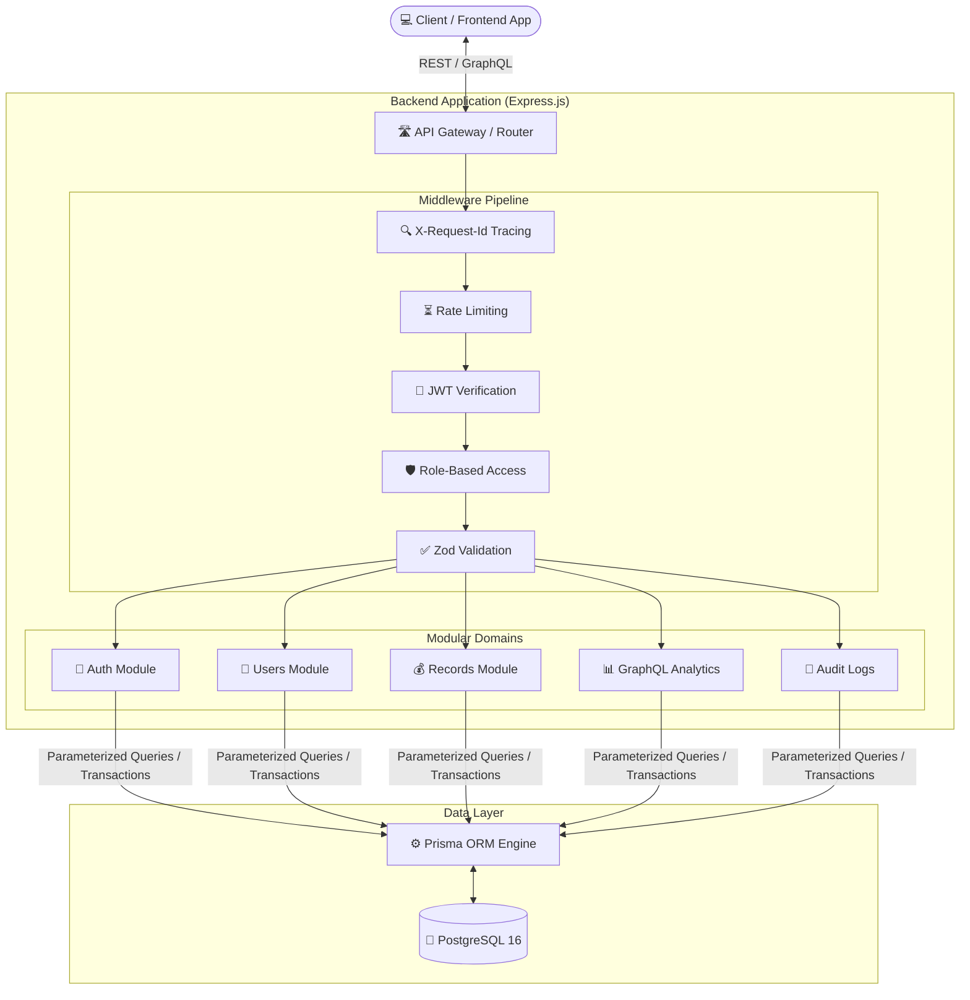
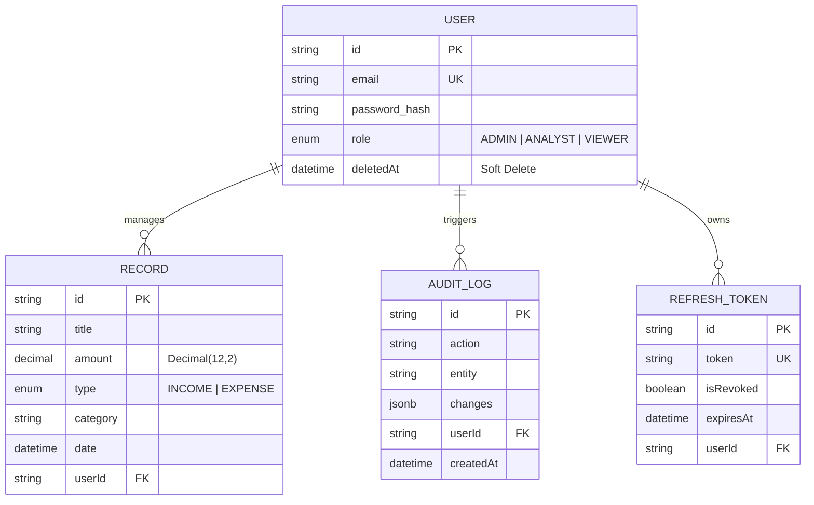
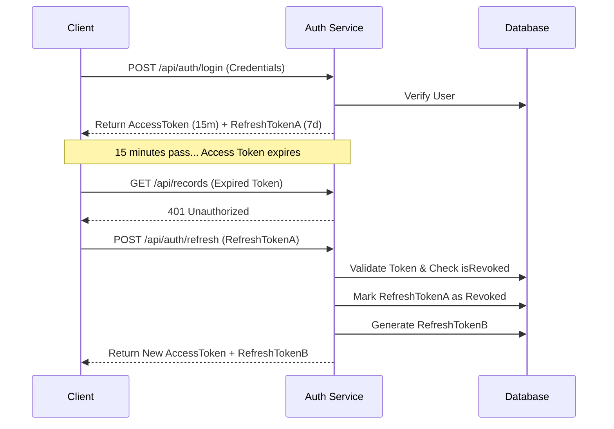
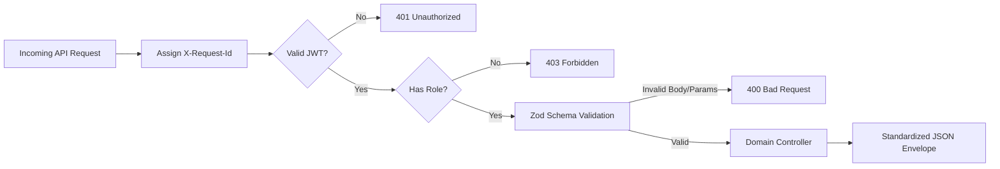

<div align="center">
  <h1>🚀 Finance Dashboard Backend</h1>
  <p>An enterprise-grade, highly structured REST & GraphQL API for scalable financial analytics.</p>

  <!-- Tech Badges -->
  
  
  
  
  
  
  
</div>

<br/>

## 🏗 High-Level System Architecture

The system utilizes a modular Node.js/Express framework. Requests are heavily filtered through a robust middleware pipeline (Tracing -> Auth -> RBAC -> Validation) before entering isolated business domains. 



## 🗄️ Entity Relationship Diagram (ERD)

The database schema is optimized for standardizing monetary precision, maintaining audit timelines, and enforcing soft-deletion for data integrity.



## 🛡️ Enterprise Security & Features

This backend is highly structured to deliver scalable, compliance-ready capabilities:

- **Protection Against SQL Injection:** Data operations rigidly process through Prisma's parameterized internal engine, structurally neutralizing raw SQL injection risks entirely.

- **Comprehensive Audit Logging:** System operations maintain an immutable schema history of tracking actions (like authentication lifecycles and record mutations). An exclusive `/api/audit-logs` integration enables Admins to search, filter, and effortlessly download CSV representations.

- **Atomic Database Transactions:** Multi-sequence features strictly execute within `$transaction` lifecycles ensuring complete atomic extensibility without risking partial corruption.

- **Strictly Modular Architecture:** Code boundaries are uniquely isolated across independent modules (auth, records, users, audit). This sharply restricts global collisions and ensures single-responsibility.

- **Request Tracing:** Every incoming API request is tagged with a unique `X-Request-Id` (UUID) which traverses through the middleware boundary and application logs.

## 🔄 JWT Rotation Implementation Flow

Zero-downtime secret rotations and absolute session security. Refresh Tokens operate on a single-use hash tracking strategy.



## 📂 Architecture & Project Structure

The project follows a feature-based architecture to establish clear boundaries.

```
src/
├── config/          # App config & Swagger setup (Environment validation, secrets mapping)
├── graphql/         # GraphQL schema & resolvers (Consolidates all dashboard analytics)
├── lib/             # Third-party instance singletons (e.g., Prisma client setup)
├── middleware/      # Cross-cutting concerns (Auth, RBAC, Validation, Error Handling, Tracing)
├── modules/         # Feature domains
│   ├── auth/        # Register, login, refresh, logout logic
│   ├── users/       # User CRUD operations (Admin-only capabilities)
│   ├── records/     # Financial record CRUD (Pagination, filtering, constraints)
│   └── dashboard/   # Dashboard service logic (Abstracted for GraphQL usage)
├── types/           # Global TypeScript interfaces and custom extensions
├── utils/           # Utilities (Custom AppError classes, Pagination helpers)
├── app.ts           # Express application scaffolding & global middleware chaining
└── server.ts        # Entry point (Handles graceful shutdown and DB checks)
```

## 👥 Roles & Permissions

Requests undergo strict Role-Based Access Control (RBAC) via middleware logic. (Admins are prevented from deleting their own accounts to ensure system recoverability).

| Action | Viewer | Analyst | Admin |
|---|---|---|---|
| View dashboard summary | ✅ | ✅ | ✅ |
| View category totals | ✅ | ✅ | ✅ |
| View recent activity | ✅ | ✅ | ✅ |
| View monthly/weekly trends | ❌ | ✅ | ✅ |
| List/view financial records | ✅ | ✅ | ✅ |
| Create/update/delete records | ❌ | ❌ | ✅ |
| Manage users | ❌ | ❌ | ✅ |

## 🚀 Quick Start

### Prerequisites

- Node.js 18+
- Docker & Docker Compose

### 1. Clone & Install
```bash
npm install
```

### 2. Start Database
```bash
docker-compose up -d
```

### 3. Setup Environment
```bash
cp .env.example .env
# Edit .env with your secrets for production
```

### 4. Run Migrations & Seed
```bash
npx prisma migrate dev --name init
```

### 5. Start Development Server
```bash
npm run dev
```

Server runs at `http://localhost:3000`.
Explore API Docs via Swagger UI: `http://localhost:3000/api/docs`

> **Note:** Seeded users (`admin@finance.com`, `analyst@finance.com`, `viewer@finance.com`) share the password: `Password123!`

## 📡 API Implementation Flow

Every request follows a standardized pipeline ensuring predictability for frontend consumers.



## 📝 Standardized Response Formats

### Success Response Envelope

```json
{
  "success": true,
  "message": "Resource retrieved",
  "data": { "..." },
  "pagination": { "page": 1, "limit": 20, "total": 45, "totalPages": 3 }
}
```

### Error Response Envelope

```json
{
  "success": false,
  "message": "Validation failed",
  "errors": {
    "body.email": ["Invalid email address"]
  },
  "requestId": "550e8400-e29b-41d4-a716-446655440000"
}
```

## 🔌 REST API Endpoints

### Auth

| Method | Endpoint | Description |
|---|---|---|
| POST | `/api/auth/register` | Register new user |
| POST | `/api/auth/login` | Login |
| POST | `/api/auth/refresh` | Refresh access token |
| POST | `/api/auth/logout` | Logout (invalidate refresh token) |

### Users (Admin only, except `/me`)

| Method | Endpoint | Description |
|---|---|---|
| GET | `/api/users/me` | Get current user |
| GET | `/api/users` | List users (pagination, search, filter) |
| GET | `/api/users/:id` | Get user by ID |
| POST | `/api/users` | Create user |
| PATCH | `/api/users/:id` | Update user |
| DELETE | `/api/users/:id` | Soft-delete user |

### Financial Records

| Method | Endpoint | Auth | Description |
|---|---|---|---|
| GET | `/api/records` | All roles | List records (pagination, filter, search, sort) |
| GET | `/api/records/:id` | All roles | Get record by ID |
| POST | `/api/records` | Admin | Create record |
| PATCH | `/api/records/:id` | Admin | Update record |
| DELETE | `/api/records/:id` | Admin | Soft-delete record |

**Query Parameters for `GET /api/records`:**

- `page`, `limit` — Pagination
- `type` — Filter by `INCOME` or `EXPENSE`
- `category` — Filter by category
- `startDate`, `endDate` — Date range filter
- `search` — Search in description and category
- `sortBy` — Sort by `date`, `amount`, or `createdAt`
- `order` — `asc` or `desc`

## 📊 Dashboard (GraphQL)

REST dashboard endpoints are replaced by a single GraphQL endpoint (`POST /graphql`). This enables clients to fetch precisely the data fragments they need (Summary + Trends) in a single round-trip, optimizing UI rendering speeds.

### Example: Comprehensive Dashboard Query
```bash
curl -X POST http://localhost:3000/graphql \
  -H "Content-Type: application/json" \
  -H "Authorization: Bearer YOUR_TOKEN" \
  -d '{
    "query": "query($months: Int, $limit: Int) { dashboardSummary { totalIncome totalExpenses netBalance } dashboardMonthlyTrends(months: $months) { month type total } dashboardRecentActivity(limit: $limit) { amount type category date } }",
    "variables": {"months": 12, "limit": 5}
  }'
```

## 🧠 Assumptions & Tradeoffs

- **GraphQL over REST for Analytics:** We opted for a single GraphQL `/graphql` endpoint for dashboard analytics rather than scattered REST routes. This minimizes client-server round-trips for complex UI dashboards.

- **Soft Deletes Strategy:** Instead of hard-deleting records and users, we utilize a `deletedAt` timestamp. This preserves foreign-key relationships, retains a traceable audit history, and avoids accidental data loss.

- **Database Precision:** Storing monetary values as floating-point types introduces precision artifacts. We utilize PostgreSQL's `Decimal(12,2)` and cast results manually back to standard JavaScript numerics securely at the service boundary.

- **Raw SQL for Dashboards:** Rather than awkwardly chaining Prisma aggregate methods, dashboard grouping routines manually execute raw queries (`$queryRaw`) mapping. This is radically more performant for group-bys across dates/intervals.

## 🧪 Testing

Tests are integrated with Docker databases to simulate true end-to-end operational readiness.

```bash
# Bring up test DB instance
docker-compose up -d

# Unified CI testing
npm run test:ci -- --verbose
```

| Test Suite | Status | Description |
|---|---|---|
| Authentication | ✅ PASS | Asserts JWT rotation, passwords validation, rate-limiting |
| User Capabilities | ✅ PASS | Validates RBAC isolation and self-deletion defenses |
| Financial Records | ✅ PASS | Checks CRUD enforcement alongside search logic |
| Dashboard Graph | ✅ PASS | Confirms granular graphql restrictions and aggregated mapping |

## ⚙️ Environment Variables

| Variable | Description | Default |
|---|---|---|
| `PORT` | Server port | `3000` |
| `NODE_ENV` | Environment | `development` |
| `DATABASE_URL` | PostgreSQL connection string | — |
| `JWT_SECRET` | Access token signing secret | — |
| `JWT_EXPIRES_IN` | Access token TTL | `15m` |
| `JWT_REFRESH_SECRET` | Refresh token signing secret | — |
| `JWT_REFRESH_EXPIRES_IN` | Refresh token TTL | `7d` |
| `RATE_LIMIT_WINDOW_MS` | Rate limit window | `900000` |
| `RATE_LIMIT_MAX_REQUESTS` | Max requests per window | `100` |

## 📄 License

MIT License
